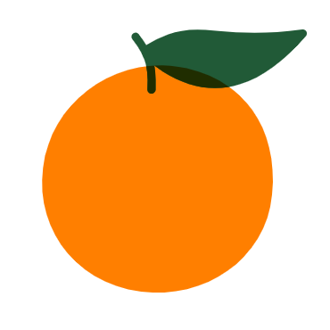

<p align="center">
  <a href="">
    
  </a>
</p>

<h1 align="center">
  <a href>Orange UI</a>
</h1>

<div align="center">

An easy UI components based on Vue.

[](https://travis-ci.org/MajorDong/Orange)


</div>

Orange UI 是一个小型的 UI 框架，提供了一些常用组件，适合桌面端使用。

组件：按钮、输入框、网格、布局、Toast、Tabs、Popover、手风琴

## 介绍

这是我在学习 Vue 时尝试造的轮子，一个 UI 框架，参考了 ELement 和 Ant Design 进行实现，希望能对你有用。

## 开始使用

1. 添加 CSS 样式
    使用本框架前，请在 CSS 中开启 border-box
    ```css
    *，*::before,*::after{ box-sizing: border-box }
    ```
    IE 8 及以上浏览器支持此样式。

2. 安装 Orange UI

    ```
    npm install orange-7
    ```
    或者
    ``` 
    yarn add orange-7
    ```
3. 引入 Orange UI
    ```js
    import { Button } from 'orange-7'

    export default {
        name: 'app',
        components: {
            'o-button': Button
        }
    }

## 文档

[官方文档](https:)

## 提问

[Issues](https://github.com/MajorDong/Orange/issues)

## 联系方式

Email: odsts@outlook.com

## 贡献代码

[Pull request](https://github.com/MajorDong/Orange/pulls)